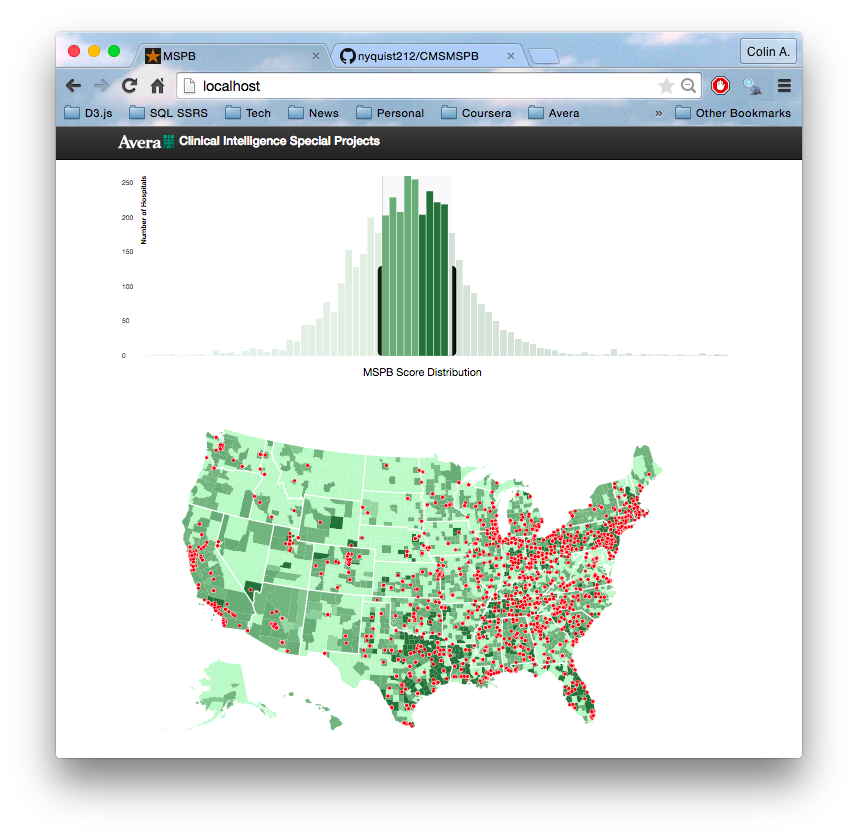

## CMS MSPB 2013 Exploration
Center for Medicare & Medicaid Servcices (CMS), Medicare Spend Per Beneficiary (MSPB) for hospitals participating in the Prospective Payment System (PPS).  

This data set describes what US hospitals are charging for treating Medicare patients. Relative costs are assigned a score from 0 to 2, with 1 being the mean.

This visualization is an Avera Health Clinical Intelligence Special Project. It aims to field test the open source Javascript libraries [D3.js] (http://d3js.org) and [Crossfilter.js] (http://crossfilter.org). These were deployed within the [BootStrap](http://getbootstrap.com/) framework.

### Data Sources
Hospital performance data is publicly available from the [data.medicare.gov] (http://data.medicare.gov) data warehouse. CMS have stated that they plan to update this data set annually.

Hospital performance scores are obtained from this file:  
[HQI\_HOSP\_MSPB.csv] (https://data.medicare.gov/resource/rrqw-56er.csv)  

Specific details of each hospital are obtained from this file:  
[Hospital General Information.csv] (https://data.medicare.gov/Hospital-Compare/Hospital-General-Information/xubh-q36u)  

The geolocation (latitude, longitude) data provided by CMS is complete and not available as part of the data file download.  

Geotagging the approx 4,700 hospitals was performed via the [Texas A&M University GeoService website](https://geoservices.tamu.edu) for approx USD10. There geocoded file can be downloaded [here](data/TA&M_NationalHospGeo.csv).

FIPS County IDs are of arguable value but were obatined form the Centers for Disease Control (CDC) [wonder.cdc.gov] (http://wonder.cdc.gov).
  
[FIPS-Zip County Cross Reference File (FIPS/ZIP4)] (http://wonder.cdc.gov/wonder/sci_data/codes/fips/type_txt/cntyxref.asp) 

## General Methods

Download the hospital source data fies (csv)  
Import it into a relational database (sqlite)  

Download the CDC cross walk files  
Use R script to process fixed width zipcty files to csv and combine into one large file
Import processed file into relational database (sqlite)  

### Processing the FIPS/ZIP4 files with R

	# Script combines the unzipped zipcty raw text files into a csv.
	# load plyr. 
	library(plyr)
	# Set your working directory. Escape your back slashes.
	setwd("C:\\Users\\cwhite2\\Documents\\Zips")
	# Create a file list from the working directory.
	f1 <- list.files(path="./", pattern="zipcty")
	f2 <- list.files(path="./", pattern=".zip")
	files <- f1[!f1 %in% f2]
	# Generate a combined csv file. Warning: It's big!
	write.csv(ldply(lapply(files, read.fwf, widths=c(5,10,2,2,2,2,2,3,25), col.names=c("ZIP", "KEY", "LOW_ZIP_Sector", "LOW_ZIP_Seg", "HI_ZIP_Sector", "HI_ZIP_SEG", "STATE", "FIPS", "COUNTY"), header=F, skip=1)) , file="combined.csv")
	
Import the geocoded Hospital file into the database.

Combine the collection of tables into a reporting table with a SQL query similar to this.

	CREATE TABLE PerfByGeo AS

	SELECT DISTINCT A.ProviderID
		,CASE 
			WHEN B.[Score] = 'Not Available'
				THEN 0
			ELSE B.[Score]
			END AS [Score]
		,A.HospitalName AS [Hospital Name]
		,A.Address
		,A.City
		,A.STATE
		,A.ZIPCode
		,A.CountyName
		,A.Latitude
		,A.Longitude
		,SUBSTR('00' || D.[Fips Code], - 2, 3) || SUBSTR('000' || C.[FIPS], - 3, 3) AS [FULL_FIPS]
	FROM [TA&M_NationalHospGeo] AS A
	INNER JOIN [HQI_HOSP_MSPB] AS B
	INNER JOIN USZipFIPS AS C
	INNER JOIN StateFIPS AS D 
		ON A.ProviderID = B.[Provider ID]
		AND A.[ZIPCode] = C.[Zip]
		AND A.[State] = D.[State]

Create a PHP accessor to run on your webserver. This accessor will open a connection to your relational database (sqlite) and return query results formatted as JSON.

	<?php 

    // Specify database from $arg[1] //
    $dir = 'sqlite:HQ_MSPB.sqlite';
    // Instantiate PDO connection object or failure msg //
    $dbh = new PDO($dir) or die("cannot open database");
    // Define your SQL statement //
    $query = '
    Select 
    	[ProviderID] AS \'provider\',
    	[Hospital Name] AS \'hospital\',
    	[CountyName] AS \'county\',
    	[Score],
    	[FULL_FIPS],
    	[Latitude] AS \'latitude\',
    	[Longitude] AS \'longitude\'
    FROM PerfByGeo 
	';
    
    // Iterate through the results and pass into JSON encoder //
    $json = array(); 
    foreach ($dbh->query($query) as $row) {
        $item = array(
            'provider' => (string)$row[0],
            'hospital' => (string)$row[1],
            'county'=> (string)$row[2],
            'score' => (real)$row[3],
            'FIPS'  => (int)$row[4],
            'latitude' => (real)$row[5],
            'longitude' => (real)$row[6]
        );
        $json[] = $item;
    }
        echo json_encode($json, JSON_UNESCAPED_SLASHES);
	?> 
	
You can now consume this JSON data in your javascript to filter it with crossfilter and illustrate it with D3.

